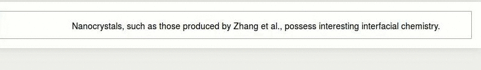

# Formatted Reference Links for Jupyter Notebooks based on .bib Files

## Example


Output gives `<a href=http://dx.doi.org/...></a>` link to the original paper with title text full citation: 

> Nanocrystals, such as those produced by <a title="Tuning sub-10 nm single-phase NaMnF3 nanocrystals as ultrasensitive hosts for pure intense fluorescence and excellent T1 magnetic resonance imaging, Chem. Commun. (Camb)., vol. 48, pg. 10322--4, Oct. 2012" href="http://dx.doi.org/10.1039/c2cc34858f">Zhang et. al., 2012</a> posses interesting interfacial chemistry. 

This exact reference used in custom_bibliography.js can be found [here](./example/example_custom_bibliography.js).

## Installation

This requires the [bibtex-parser](https://github.com/mikolalysenko/bibtex-parser) package also.

```bash
mkdir ~/.jupyter/custom
cd ~/.jupyter/custom
git clone git@github.com:mikolalysenko/bibtex-parser.git
git clone git@github.com:michaelplews/jupyter-markdown-citations.git
touch ./jupyter-markdown-citations/custom_bibliography.js
echo 'var bibliography = ""' >> ./jupyter-markdown-citations/custom_bibliography.js
```

 - Creates the custom jupyter installs directory
 - Installs dependencies
 - Installs this package
 - Creates the custom_bibliography.js file
 - Adds the bibliography variable to the file

This repo is currently under development
